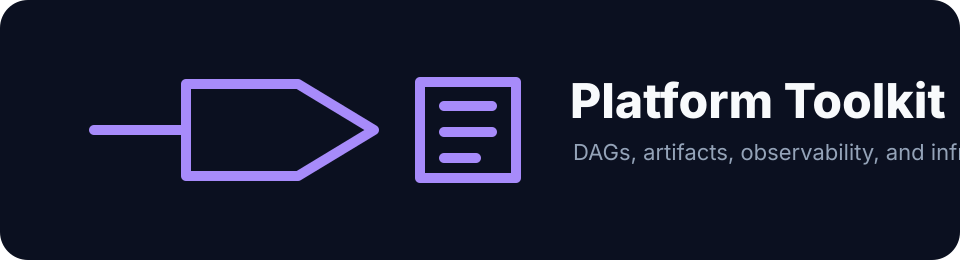
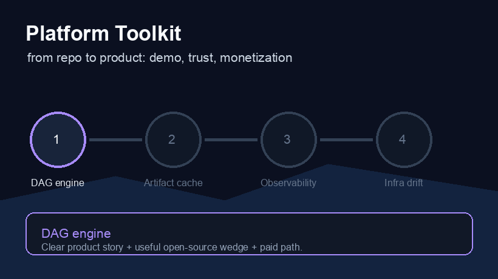

# platform-toolkit



Python tools I've built and refined across years of running CI/CD at scale — a pipeline DAG engine, streaming observability primitives, and infrastructure config management. Three packages, one repo.




---

## Packages

| Package | What it does |
|---|---|
| `pipeline/` | DAG-based job graph, artifact caching, priority scheduler, async executor |
| `observability/` | Sliding-window metrics, streaming log aggregation, rule-based alerting |
| `infra/` | Layered config with deep-merge, drift detection, snapshot state store |

---

## Python concepts demonstrated

Rather than a feature checklist, here's how each concept appears in the actual code:

**Generators / `yield` / `yield from`**
- `DAG.layers()` — yields parallel execution batches without materialising the full graph
- `DAG.affected_by()` — BFS traversal via a generator; callers can short-circuit early
- `DriftDetector.compare()` — recursive generator using `yield from` to flatten nested diffs
- `LogAggregator.sliding_window()` — rolling window over a log stream, one list per tick
- `ArtifactCache.stale_entries()` — lazy eviction scan; nothing allocated until iterated

**Iterator / Iterable protocols (`__iter__`, `__next__`)**
- `_TopologicalIterator` — Kahn's algorithm implemented as a hand-rolled iterator class
- `_CacheIterator` — iterates cache entries in creation-time order
- `MetricSeries` — time-windowed ring buffer iterable; `for m in series` auto-trims stale data
- `DAG`, `JobScheduler`, `StateStore` — all expose `__iter__` for natural `for` loop usage

**`@staticmethod` / `@classmethod`**
- `DAG.validate_no_cycles()` — pure utility, no instance needed
- `DAG.from_dict()`, `DAG.merge()` — named constructors
- `JobScheduler.estimate_wait()` — calculator over a heap snapshot
- `JobScheduler.from_pipeline()` — deserialises a job spec list
- `AlertRule.threshold()`, `AlertRule.rate_of_change()` — factory methods on the ABC itself
- `DriftDetector.for_kubernetes()`, `.for_terraform()` — pre-configured detectors

**`copy.copy` / `copy.deepcopy`**
- `DAG.__copy__` — shallow fork shares `DagNode` references (safe: nodes are frozen)
- `DAG.__deepcopy__` — full independence for mutation-heavy forks
- `ArtifactCache.fork()` — shallow copy is 10x cheaper; safe because `Artifact` is frozen
- `ArtifactCache.snapshot()` — deep copy for true snapshot isolation
- `Config.snapshot()` vs `Config.fork()` — deep vs shallow with explicit tradeoff comments
- `StateStore.get()` — always returns a deepcopy; callers can't accidentally corrupt state

**`@dataclass` / `__slots__` / frozen**
- `DagNode` — `@dataclass(slots=True)`: no `__dict__`, hashable, fast attribute access
- `Artifact` — `@dataclass(slots=True, frozen=True)`: immutable record, safe in sets/dicts
- `JobResult` — `@dataclass(slots=True)`: tight memory for high-throughput execution logs
- `ConfigLayer` — manual `__slots__`: minimal overhead when stacking many config layers

**`Protocol` / `ABC` / descriptors**
- `MetricBackend` — `@runtime_checkable` Protocol; `MetricsCollector` satisfies it at runtime
- `AlertRule` — abstract base with `@abstractmethod evaluate()`; forces subclass contract
- `_TypedField` — full descriptor (`__set_name__`, `__get__`, `__set__`) for type-enforced fields on `StateStore`

**Pattern matching (`match`/`case` — Python 3.10+)**
- `DriftResult.__str__` — renders drift output by matching on `DriftType` enum
- `DriftDetector.patch()` — dispatch on drift type without a chain of if/elif

**Context managers**
- `ArtifactCache.transaction()` — `@contextmanager` for atomic batch writes; rolls back on exception
- `ExecutionContext` — async context manager; cleans up execution state on exit

**`asyncio` / async generators**
- `JobExecutor.run_layer()` — async generator that yields results as each job completes, not after all finish
- `ExecutionContext` — `async with` pattern for session lifecycle

**`MutableMapping`**
- `Config` and `ConfigLayer` — implement full mapping protocol so they work as drop-in dict replacements in any framework

**`Generic` / `TypeVar`**
- `_TypedField[T]` — generic descriptor parameterised on the field type

---

## Architecture

> Open `diagrams/architecture.drawio` in [diagrams.net](https://diagrams.net) for the interactive version.

```
platform-toolkit/
├── pipeline/
│   ├── dag.py          DAG + _TopologicalIterator
│   ├── artifact.py     ArtifactCache + Artifact
│   ├── scheduler.py    JobScheduler + Priority
│   └── executor.py     JobExecutor + ExecutionContext
├── observability/
│   ├── collector.py    MetricsCollector + MetricSeries
│   ├── aggregator.py   LogAggregator
│   └── alerts.py       AlertEngine + AlertRule (ABC)
├── infra/
│   ├── config.py       Config + ConfigLayer (MutableMapping)
│   ├── drift.py        DriftDetector + DriftResult
│   └── state.py        StateStore + Snapshot + _TypedField
├── demos/
│   ├── demo_pipeline.py
│   ├── demo_observability.py
│   ├── demo_infra.py
│   └── record_gifs.sh
├── tests/              47 tests, all passing
└── diagrams/
    └── architecture.drawio
```

---

## Quickstart

```bash
git clone https://github.com/gerardrecinto/platform-toolkit
cd platform-toolkit

# Run the demos
PYTHONPATH=. python3 demos/demo_pipeline.py
PYTHONPATH=. python3 demos/demo_infra.py
PYTHONPATH=. python3 demos/demo_observability.py

# Run the test suite
python3 -m pytest tests/ -v
```

No dependencies outside the standard library.

---

## Demo: pipeline


```python
from pipeline import DAG

dag = DAG.from_dict({
    "checkout":   {"command": "git checkout main", "depends_on": []},
    "lint":       {"command": "ruff check .", "depends_on": ["checkout"]},
    "unit-tests": {"command": "pytest tests/", "depends_on": ["checkout"]},
    "build":      {"command": "docker build .", "depends_on": ["lint", "unit-tests"]},
})

# Iterate in dependency-safe order
for node in dag:
    print(node.name)

# Get parallel execution batches
for layer in dag.layers():
    print([n.name for n in layer])

# Find everything broken by a change
list(dag.affected_by("unit-tests"))  # ['build']
```

## Demo: drift detection


```python
from infra import DriftDetector

detector = DriftDetector.for_kubernetes()

desired = {"deployment": {"replicas": 8, "image": "app:v2.1.0"}}
actual  = {"deployment": {"replicas": 3, "image": "app:v2.0.9"}}

for result in detector.drifted_only(desired, actual):
    print(result)
# ~ deployment.image: 'app:v2.1.0' → 'app:v2.0.9'
# ~ deployment.replicas: 8 → 3
```

## Demo: alerting

```python
from observability import AlertEngine, AlertRule, AlertSeverity

engine = AlertEngine()
engine.register(
    AlertRule.threshold("high-error-rate", "error_rate", above=0.1,
                        severity=AlertSeverity.CRITICAL).with_cooldown(60),
    "error_rate",
)

for alert in engine.evaluate(series_map):
    print(alert)
```

---

## Tests

```
$ python3 -m pytest tests/ -v

tests/test_dag.py::test_topological_order     PASSED
tests/test_dag.py::test_layers                PASSED
tests/test_dag.py::test_affected_by           PASSED
tests/test_dag.py::test_critical_path         PASSED
...
======================== 47 passed in 0.16s =========================
```

---

## Requirements

Python 3.12+. No third-party dependencies.

## Product Direction

This repo is a credibility engine and reusable primitive library for bigger products like DevOpsLedger and DevOps MCP. It can also support consulting, workshops, and training around platform engineering patterns.

See [docs/go-to-market.md](docs/go-to-market.md).
